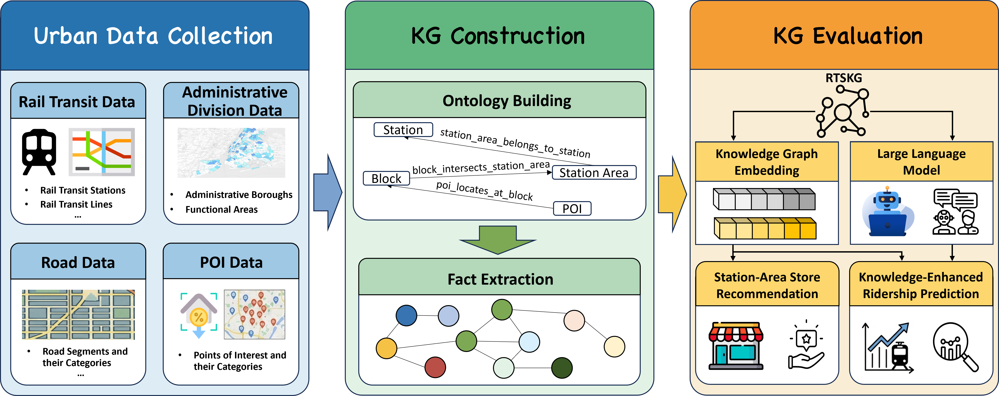

# RTSKG: A Rail Transit Station Knowledge Graph Dataset



RTSKG is a rail transit station knowledge graph dataset designed to model spatial and semantic interactions among urban entities related to rail transit stations. It currently contains sub-KGs for New York City and Chicago, together with the RTSKG ontology and RDF dump files.

## Project Structure

- Ontology: [ontology.owl](./ontology/ontology.owl)
- Instances for New York City: [new_york_city/](./new_york_city/)
- Instances for Chicago: [chicago/](./chicago/)
- Source code of RTSKG: [code/](./code/)

## RDF Dumps

The RDF dump files are archived on Zenodo:

- Zenodo record: [https://zenodo.org/records/20025759](https://zenodo.org/records/20025759)

## Namespace

The persistent namespace of RTSKG is maintained via w3id:

- Class: <https://w3id.org/rtskg/ontology/class/>
- Attribute: <https://w3id.org/rtskg/ontology/dataproperty/>
- Relation: <https://w3id.org/rtskg/ontology/objectproperty/>
- New York City instance: <https://w3id.org/rtskg/new_york_city/instance/>
- Chicago instance: <https://w3id.org/rtskg/chicago/instance/>


## License

## License

The data resources are released under the CC BY-SA 4.0 License. See [LICENSE_DATA](./LICENSE_DATA).

The source code is released under the Apache License 2.0. See [LICENSE_CODE](./LICENSE_CODE).

[//]: # (## Citation)

[//]: # ()
[//]: # (If you use RTSKG in your work, please cite:)

[//]: # ()
[//]: # (```bibtex)

[//]: # (@misc{rtskg2026,)

[//]: # (  title        = {RTSKG: A Rail Transit Station Knowledge Graph Dataset},)

[//]: # (  author       = {TODO: add authors},)

[//]: # (  year         = {2026},)

[//]: # (  publisher    = {Zenodo},)

[//]: # (  doi          = {10.5281/zenodo.20025759},)

[//]: # (  url          = {https://doi.org/10.5281/zenodo.20025759})

[//]: # (})