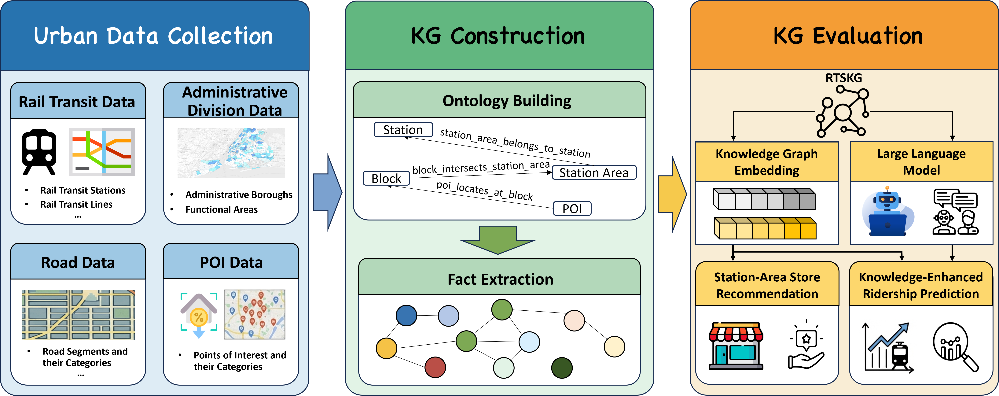

# RTSKG: Building a Rail Transit Station Knowledge Graph Dataset

## Project Structure

- Ontology: [ontology.owl](./ontology/ontology.owl)
- Instances for New York City: [new_york_city/](./new_york_city/)
- Instances for Chicago: [chicago/](./chicago/)
- Source code of RTSKG: [code/](./code/)
- Dataset metadata (VoID, DCAT, Dublin Core): [dataset_metadata.ttl](./dataset_metadata.ttl)
- Source dataset descriptions (DCAT/Dublin Core; PROV-O provenance targets): [source/](./source/)
- Documentation (including files generated by Widoco) and images: [docs/](./docs/)
- Example SPARQL queries: [example_queries/](./example_queries/)

## RDF Dumps

- 

## Namespace

The persistent namespace of RTSKG is maintained via w3id:

- Ontology IRI: [https://w3id.org/rtskg/ontology](https://w3id.org/rtskg/ontology)
- Class: [https://w3id.org/rtskg/ontology/class/](https://w3id.org/rtskg/ontology/class/)
- Attribute: [https://w3id.org/rtskg/ontology/dataproperty/](https://w3id.org/rtskg/ontology/dataproperty/)
- Relation: [https://w3id.org/rtskg/ontology/objectproperty/](https://w3id.org/rtskg/ontology/objectproperty/)
- New York City instance: [https://w3id.org/rtskg/new_york_city/instance/](https://w3id.org/rtskg/new_york_city/instance/)
- Chicago instance: [https://w3id.org/rtskg/chicago/instance/](https://w3id.org/rtskg/chicago/instance/)

## Documentation

Human-readable documentation of the RTSKG ontology, generated with Widoco, is provided in [docs/](./docs/) and can be browsed online via GitHub Pages at [https://seucoin.github.io/RTSKG/](https://seucoin.github.io/RTSKG/).

## Competency Questions

These competency questions state, in natural language, the urban analysis information needs that RTSKG is designed to answer. They define the intended scope of the resource and motivate which data types are integrated.

| #    | Competency question                                                                                               | How RTSKG supports it                                                                                                                                                                                                                                       |
| ---- | ----------------------------------------------------------------------------------------------------------------- | ----------------------------------------------------------------------------------------------------------------------------------------------------------------------------------------------------------------------------------------------------------- |
| CQ1  | Which stations are served by a rail transit line, and which line(s) serve a given station?                        | Stations are linked to lines by `station_belongs_to_line`; querying this relation returns the stations on a line and the line(s) serving a station.                                                                                                         |
| CQ2  | Which POIs can be reached on foot within 5 or 10 minutes from a given station?                                    | Each station has a 5-minute and a 10-minute station area, and POIs are linked to the station areas containing them (`poi_locates_at_station_area`); querying these returns the POIs within each walking-time threshold of a station.                        |
| CQ3  | What is the dominant POI category within a given station area?                                                    | POIs are linked to station areas and classified by POI category; querying returns the number of POIs in each category within a station area, from which the dominant (most frequent) category is identified.                                                |
| CQ4  | What is the land-use mix of a given urban block?                                                                  | The land-use mix of a block reflects how diverse and evenly distributed its POI categories are. RTSKG links POIs to blocks and their categories, so querying `poi_locates_at_block` and `poi_has_poi_category` returns the number of POIs in each category. |
| CQ5  | Which roads traverse multiple functional areas, connecting different parts of the city?                           | Roads are linked to functional areas by `road_intersects_functional_area`; querying returns the roads that intersect more than one functional area.                                                                                                         |
| CQ6  | What are the road network characteristics of a given functional area?                                             | Roads are linked to functional areas and assigned road categories; querying returns the number of roads in each category within a functional area.                                                                                                          |
| CQ7  | What is the rail transit service coverage of a given functional area, and which borough does it belong to?        | Functional areas are linked to their station areas and to a borough; querying returns the number of stations covering a functional area and the borough it belongs to.                                                                                      |
| CQ8  | Which functional areas are adjacent to a given functional area, and do they have similar dominant POI categories? | Adjacency between functional areas and the POI category distributions of their blocks are represented; querying returns the neighbouring functional areas and the number of POIs in each category, so their dominant categories can be compared.            |
| CQ9  | Which urban blocks are covered by the station areas along a given rail transit line?                              | Lines, stations, station areas, and blocks are linked; querying returns the set of blocks intersected by the station areas of all stations on a line.                                                                                                       |
| CQ10 | What functional composition patterns can be observed along a given rail transit line across its station areas?    | POIs and POI categories are linked to station areas; querying returns, for each station on a line, the POI category distribution of its 5-minute station area, which reflects its functional composition and how this varies along the line.                |

Example SPARQL queries that express these competency questions are provided in [example_queries/](./example_queries/).

## Sustainability and Maintenance

RTSKG is designed to support long-term availability. The ontology and all instances are identified using persistent, dereferenceable `w3id.org` identifiers, and the RDF dumps are archived on Zenodo. The relevant code and documentation are provided on GitHub to support reuse and extension. Each released version is annotated with `owl:versionInfo` for clear version identification.

The resource is maintained by the RTSKG core development team, which is responsible for correcting data errors, ensuring the quality of the knowledge graph, and maintaining the associated Zenodo and GitHub resources. The ontology and the released RDF data support adoption and adaptation by the community in future applications. We plan to release updates in response to substantial changes in the upstream data or revisions to the knowledge graph, and the updated Zenodo links and other information will be reflected in the documentation accordingly.

## License

The data resources are released under the CC BY-SA 4.0 License. See [LICENSE_DATA](./LICENSE_DATA).

The source code is released under the Apache License 2.0. See [LICENSE_CODE](./LICENSE_CODE).